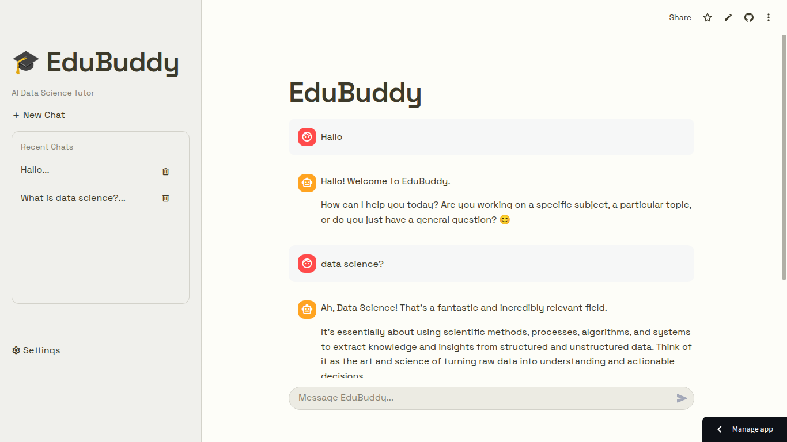

# EduBuddy — Data Science Tutor (LLM-powered Chatbot)

## Deskripsi
EduBuddy adalah chatbot tutor interaktif untuk materi Data Science pemula. Dibuat menggunakan Streamlit dan LLM (OpenAI-compatible / Gemini). Fitur: chat, persona, memory sederhana, dan contoh integrasi LLM.

## Demo
[](https://edubuddy-em.streamlit.app/)



## Struktur Repo

```
edubuddy/
├── app.py
├── app_full.py
├── requirements.txt
├── .env.sample
├── utils/
│   ├── llm_api.py
│   └── memory.py
├── data/
│   └── memory.json
└── assets/
    └── screenshots/
```

## Cara menjalankan (lokal)

1. Clone repo:
   ```bash
   git clone <repo-url>
   cd edubuddy
   ```

2. Buat virtualenv & install:
   ```bash
   python -m venv venv
   source venv/bin/activate  # atau venv\Scripts\activate di Windows
   pip install -r requirements.txt
   ```

3. Salin `.env.sample` ke `.env` lalu isi `OPENAI_API_KEY` dan `MODEL_NAME`:
   ```bash
   cp .env.sample .env
   # Edit .env dengan editor favorit
   ```
   Isi contoh `.env`:
   ```
   OPENAI_API_KEY=sk-...
   MODEL_NAME=gpt-4o-mini
   ```

4. Jalankan aplikasi:
   ```bash
   streamlit run app_full.py
   ```

## Penjelasan kode

* `app_full.py` — aplikasi Streamlit penuh dengan integrasi LLM & memory sederhana.
* `utils/llm_api.py` — wrapper untuk memanggil LLM (OpenAI-compatible). Ganti sesuai provider jika perlu.
* `utils/memory.py` — helper simpan/load memory ke file JSON.

## Cara deploy

* Streamlit Cloud: push repo ke GitHub, hubungkan ke share.streamlit.io, atur Secret `OPENAI_API_KEY`.
* Docker: buat Dockerfile jika ingin deploy di VPS.

## Catatan keamanan

* Jangan commit `.env` yang berisi API key.
* Hindari mengeksekusi kode dari user tanpa sandboxing.

## Lisensi

MIT
